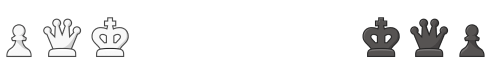

 

  
     
     
      <i>Een interactief schaakspel vanaf nul opgebouwt.
         Gemaakt in Javascript met een Object Oriented structuur.</i>
   

  <a href="https://milansteman.github.io/chess"><strong>https://milansteman.github.io/chess</strong></a>
   

## Features
- [x] Volledig werkende zetten (incl. speciale zetten als <a href="https://en.wikipedia.org/wiki/Castling#:~:text=Castling%20is%20a%20move%20in,that%20the%20king%20passed%20over.">rokade</a>, <a href="https://en.wikipedia.org/wiki/En_passant">en-passant</a>, etc.) en checks op schaak(mat);
- [x] Zetten maken via drag & drop of klik.
- [x] State management voor schaakmat, pat(stelling), timers en onvoldoende materiaal;
- [x] Opslaan van geslagen stukken en materiaal 'telling';
- [x] Opslaan van gemaakte zetten en omzetten naar de juiste <a href="https://www.chess.com/terms/chess-notation">annotatie</a>.
- [x] Van kant wisselen en nieuwe wedstrijd starten.

